# 🏠 Smart Home Controller Using PIR, LDR, DHT22 Sensors, SSD1306 OLED, and ESP32 Microcontroller

> A comprehensive, multi-sensor embedded home automation controller built with **ESP32 DevKit V4 / Embedded C++** that automatically controls room lighting based on motion detection + ambient light level, regulates fan cooling via temperature-threshold hysteresis ($30.0°C$ ON / $28.0°C$ OFF), implements a 3-state latching security alarm system with pulsating buzzer, provides manual override via debounced push-button switches with priority-based control hierarchy, and displays real-time telemetry on a 128×64 SSD1306 I2C OLED display.

---

## 👨‍💻 Author

**Adarsh Srivastav**  
Computer Science and Engineering (CSE) Student  
Embedded Systems | IoT | Python | AI

---

## 📌 Project Overview

The **Smart Home Controller Using PIR, LDR, DHT22 Sensors and Microcontroller** is an industry-oriented embedded system prototype designed to address energy inefficiency, security vulnerabilities, and manual inconvenience in residential and commercial spaces.

Traditional home environments rely heavily on manual intervention for lighting, climate control, and security monitoring. Lights are frequently left running in empty or well-lit rooms, fans continue operating when temperatures drop below comfort levels, and basic security systems lack intelligent integration with home automation. These inefficiencies result in unnecessary energy consumption, increased utility costs, and compromised safety when human error occurs.

This project delivers a **multi-sensor autonomous embedded solution** with local OLED telemetry:

- **Intelligent Lighting Control**: A **PIR motion sensor** (HC-SR501) detects human presence while a **Photoresistor Sensor Module** measures ambient light. The room light (Yellow LED on GPIO 25) activates **only** when motion is detected AND the room is dark ($ADC > 2000$), with an automatic 30-second timeout using non-blocking `millis()` timing.

- **Temperature-Based Fan Control with Hysteresis**: A **DHT22 sensor** continuously monitors ambient temperature. The cooling fan (Cyan LED on GPIO 26) engages at $\geq 30.0°C$ and disengages only when temperature drops to $\leq 28.0°C$, implementing a $2.0°C$ dead-band hysteresis to prevent relay chattering.

- **3-State Latching Security Alarm System**: When armed via push button, any PIR motion triggers a **latched alarm state** — the active buzzer (GPIO 14) pulses at 500ms intervals, the Red LED (GPIO 12) illuminates solid, and the OLED displays `!! ALERT !!`. The alarm **remains latched** even after the intruder leaves the sensor range, requiring manual disarm to reset.

- **Manual Override with Priority Hierarchy**: Four debounced push buttons provide manual control. The priority hierarchy ensures safety: **Security (highest)** → **Manual Override** → **Automatic Control (lowest)**.

- **Live 128×64 SSD1306 OLED Dashboard**: Real-time temperature, humidity, light/fan status, motion detection, operating mode (AUTO/MANUAL), and security state are displayed locally on the I2C OLED display, refreshing every 500ms.

The complete prototype was developed and validated virtually using **Wokwi** with **ESP32 and PlatformIO**, providing practical experience in analog-to-digital conversion, I2C communication, GPIO control, finite state machines, non-blocking cooperative scheduling, UART serial telemetry debugging, and professional embedded C++ documentation.

> **Project Note:** The current project is a **functional virtual prototype** validated in Wokwi and PlatformIO. Physical hardware validation can be performed using the included schematics and wiring guides. LEDs are used as safe simulated loads instead of mains AC appliances.

---

## 🎯 Objectives

- [x] Design and implement a multi-sensor data acquisition system using analog, digital, and I2C interfaces.
- [x] Develop deterministic, non-blocking control logic using `millis()` for concurrent task execution.
- [x] Implement automatic lighting control combining PIR motion detection with LDR ambient light sensing.
- [x] Create a robust thermal regulation system using temperature threshold hysteresis ($\Delta T = 2.0°C$).
- [x] Build a 3-state latching security system (DISABLED → ARMED → ALERT) with visual and acoustic feedback.
- [x] Integrate a 128×64 SSD1306 OLED display for real-time telemetry and system status visualization.
- [x] Design a manual override system with hardware debouncing and priority-based control.
- [x] Utilize a 12-bit ADC with voltage divider network for ambient light measurement ($0 - 4095$ range).
- [x] Implement a configurable 30-second motion timeout to prevent premature lighting deactivation.
- [x] Map and manage multiple ESP32 GPIO pins across Input, Output, ADC, and I2C electrical domains.
- [x] Format and transmit structured telemetry data via UART at 115200 baud for serial monitoring.
- [x] Apply professional code organization using C++ headers and modular function design.
- [x] Validate embedded logic using Wokwi virtual simulation before physical deployment.
- [x] Document the system architecture comprehensively for academic and professional review.
- [x] Demonstrate mastery of Embedded C/C++ programming in a practical application.

---

## ✨ Key Features

1. **Dual-Condition Intelligent Lighting** — Combines PIR motion data with LDR ambient light levels to activate lights only when dark AND occupied.
2. **Temperature Hysteresis Control** — Prevents fan rapid-cycling (chattering) using distinct ON ($30.0°C$) and OFF ($28.0°C$) thresholds with a $2.0°C$ dead-band.
3. **3-State Latching Security Alarm** — Motion in armed mode triggers an indefinite alarm that requires manual intervention to reset.
4. **Hardware Manual Override** — Dedicated physical push buttons allow users to bypass sensor-driven automation.
5. **Real-time OLED Telemetry Dashboard** — Continuously displays temperature, humidity, light levels, and active system mode on an I2C screen.
6. **Non-blocking Architecture** — Utilizes `millis()` timing throughout; zero `delay()` calls in the main loop for responsive multitasking.
7. **Multi-level Visual Indication** — Distinct LED colors (Yellow = Light, Cyan = Fan, Red = Alert, Green = Safe) represent different system states.
8. **Internal Pull-up Resistors** — Leverages ESP32's internal `INPUT_PULLUP` resistors for switches, simplifying the external circuit.
9. **Critical Temperature Alert** — Automatically flags and reports when ambient temperatures exceed $45.0°C$.
10. **Configurable Motion Timeout** — 30-second retriggerable monostable retains ON state during brief periods of stillness.
11. **Finite State Machine Security** — Deterministic state transitions ensure predictable behavior under all sensor input combinations.
12. **Structured Serial Telemetry** — Formatted UART output at 115200 baud for seamless integration with data loggers.
13. **Dual Build Support** — Fully compatible with both PlatformIO (modular) and Arduino IDE (monolithic) environments.
14. **Software Debounced Switches** — Prevents false triggering from mechanical switch bounce during manual overrides.
15. **Virtual Prototyping Ready** — Complete Wokwi `diagram.json` included for instant, zero-hardware testing.

---

## 🏗️ System Architecture

```text
+-------------------------------------------------------------------------------------------+
|                                  SMART HOME CONTROLLER SYSTEM                             |
+-------------------------------------------------------------------------------------------+
|                                                                                           |
|     INPUT LAYER                     CONTROL LOGIC (ESP32)                 OUTPUT LAYER    |
|     ===========                     =====================                 ============    |
|                                                                                           |
| [PIR Motion Sensor] -----→ (GPIO27) --+                      +-- (GPIO25) -----→ [Yellow LED]
|                                       |                      |                   (Room Light)
| [LDR Light Sensor ] -----→ (GPIO34) --|    +-------------+   |
|  (Voltage Divider)        (ADC1_CH6)  |    |             |   +-- (GPIO26) -----→ [Cyan LED]
|                                       |    |  Priority   |   |                   (Fan Output)
| [DHT22 Sensor     ] -----→ (GPIO4)  --|    |  Controller |   |
|  (Temp/Humidity)            (1-Wire)  |----|             |---+-- (GPIO14) -----→ [Active Buzzer]
|                                       |    |  Automation |   |                   (Security Alarm)
| [Security Switch  ] -----→ (GPIO18) --|    |  Rules      |   |
|  (Arm/Disarm)                         |    |             |   +-- (GPIO12) -----→ [Red LED]
|                                       |    |  State      |   |                   (Alert Status)
| [Override Switch  ] -----→ (GPIO19) --|    |  Machine    |   |
|  (Auto/Manual)                        |    |             |   +-- (GPIO13) -----→ [Green LED]
|                                       |    +-------------+   |                   (Safe Status)
| [Light Toggle     ] -----→ (GPIO32) --|          |           |
|  (Manual Mode)                        |          |           +-- (GPIO21) -+---→ [SSD1306 OLED]
|                                       |          |           +-- (GPIO22) -+     (I2C Display)
| [Fan Toggle       ] -----→ (GPIO33) --+          |
|  (Manual Mode)                                   ↓
|                                        [Serial Telemetry]
|                                           (TX/RX 115200)
+-------------------------------------------------------------------------------------------+
```

---

## 🔄 Working Principle

The controller operates on an infinite, non-blocking loop that sequentially samples sensors, evaluates priority layers, computes logical outcomes, and updates physical outputs.

```text
    [START]
       |
       v
[Initialize Hardware] ----→ (Setup Pins, I2C, Serial, OLED)
       |
       +--------------------------------------------------+
       |                                                  |
       v                                                  |
[Read Sensors & Switches] ←------------------------+      |
(LDR, DHT22, PIR, Buttons)                         |      |
       |                                            |      |
       v                                            |      |
[Check Priority: SECURITY]                          |      |
Is Security Mode Armed?                             |      |
 |---(YES)---→ Motion Detected?                     |      |
 |               |--(YES)--→ [LATCH ALARM]          |      |
 |               |           (Buzzer ON, Red ON)    |      |
 |               |           (Light FORCED ON)      |      |
 |               |           Skip Auto Logic -------|      |
 |               |                                  |      |
 |               +--(NO)---→ [MAINTAIN ARMED]       |      |
 |                           (Monitoring...)  ------|      |
 |                                                  |      |
 +---(NO)----→ [Check Priority: OVERRIDE]           |      |
               Is Manual Override Active?           |      |
                |---(YES)---→ Map physical toggle   |      |
                |             switches directly to  |      |
                |             Light and Fan outputs  |      |
                |             Skip Auto Logic ------|      |
                |                                   |      |
                +---(NO)----→ [AUTOMATIC LOGIC]     |      |
                                     |              |      |
          +-------------------------++--------------+      |
          |                          |                     |
          v                          v                     |
  [Lighting Control]          [Fan Control]                |
  Is LDR > 2000?              Is Temp ≥ 30°C?             |
  AND Motion == HIGH?         |-(YES)-→ [FAN ON]           |
  |-(YES)-→ [LIGHT ON]       |                            |
  |         Reset Timer       Is Temp ≤ 28°C?             |
  |                           |-(YES)-→ [FAN OFF]          |
  |-(NO)--→ Timeout?          |                            |
            |-(YES)-→ [OFF]   |-(NO)--→ [HOLD STATE]      |
                                       |                   |
                                       v                   |
                               [Update OLED Display]       |
                               [Transmit Serial Telemetry] |
                                       |                   |
                                       +-------------------+
```

---

## 📐 Sensor Calculations

### LDR Voltage Divider & ADC Reading

The ESP32 reads ambient light using a 12-bit Analog-to-Digital Converter (ADC). The LDR is configured in a voltage divider with a fixed $10k\Omega$ resistor.

$$V_{out} = V_{cc} \times \frac{R_{fixed}}{R_{LDR} + R_{fixed}}$$

Where:
- $V_{cc} = 3.3V$
- $R_{fixed} = 10{,}000\;\Omega$
- $R_{LDR}$ = Variable resistance (low in bright light, high in dark)

The 12-bit ADC converts this voltage to a digital integer:
$$ADC\_Value = \left(\frac{V_{out}}{V_{ref}}\right) \times 4095$$

### LDR Calibration Look-Up Table

| Environment | $R_{LDR}$ ($\Omega$) | $V_{out}$ (V) | ADC Reading (0-4095) | Logical State | Light Output |
|---|---:|---:|---:|---|---|
| **Bright Sun** | $\approx 100$ | $\approx 3.26$ | $\approx 4050$ | BRIGHT | OFF |
| **Normal Room** | $\approx 1{,}000$ | $\approx 3.00$ | $\approx 3720$ | BRIGHT | OFF |
| **Dim Room** | $\approx 10{,}000$ | $\approx 1.65$ | $\approx 2048$ | BRIGHT | OFF |
| **Dark Room** | $\approx 50{,}000$ | $\approx 0.55$ | $\approx 680$ | **DARK (< 1000)** | ON (if motion) |
| **Total Darkness** | $> 100{,}000$ | $\approx 0.30$ | $\approx 370$ | **DARK (< 1000)** | ON (if motion) |

### Temperature Hysteresis Formula

To prevent rapid toggling (chattering) near the threshold:

$$Fan\_State = \begin{cases} 1 \text{ (ON)}, & \text{if } T \geq T_{high} = 30.0°C \\ 0 \text{ (OFF)}, & \text{if } T \leq T_{low} = 28.0°C \\ Fan\_State_{prev}, & \text{if } T_{low} < T < T_{high} \end{cases}$$

Dead-band width: $\Delta T = T_{high} - T_{low} = 2.0°C$

### Hysteresis Behavior Table

| Temperature ($°C$) | Direction | Hysteresis Zone | Fan Output |
|---:|---|---|---|
| 27.5 | Rising | Below Setpoint | OFF |
| 29.0 | Rising | Inside Dead-band | OFF (maintains) |
| 30.5 | Rising | Above Setpoint | **ON** |
| 29.0 | Falling | Inside Dead-band | **ON (maintains)** |
| 27.5 | Falling | Below Setpoint | OFF |

### Motion Timeout Calculation

PIR sensors drop to LOW between movements. A software-based retriggerable monostable multivibrator keeps lights stable:

**Timeout Constant:** `MOTION_TIMEOUT = 30000` ms (30 seconds)

1. If `digitalRead(PIR) == HIGH` → set `lastMotionTime = millis()`
2. If `(millis() - lastMotionTime) < MOTION_TIMEOUT` → keep Light ON
3. If `(millis() - lastMotionTime) >= MOTION_TIMEOUT` → turn Light OFF

---

## 🔒 Security System State Machine

The security system operates as a Finite State Machine (FSM) with **latching behavior** — once triggered, the alarm persists until manually reset.

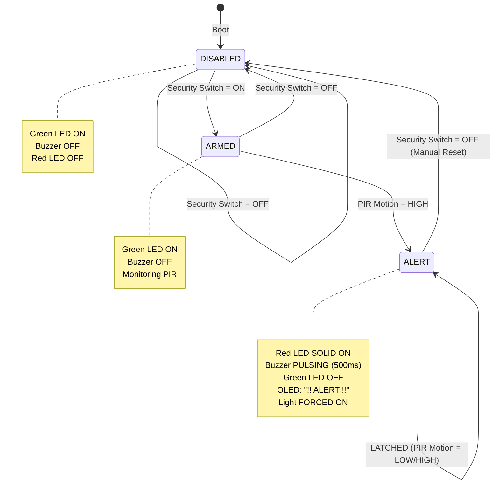

---

## ⚡ Priority Hierarchy

The system evaluates conditions based on a strict numbered priority list:

1. **SECURITY (Highest Priority)** — When a security alert is active, ALL automatic and manual environmental controls are suspended. The PIR sensor is dedicated to intrusion detection. Light is forced ON to illuminate the area. Fan is forced OFF.

2. **MANUAL OVERRIDE (Secondary Priority)** — When `MANUAL_OVERRIDE_PIN` (GPIO 19) is active, automatic sensor-based logic is bypassed. Physical Light and Fan toggle switches directly command the output LEDs.

3. **AUTOMATIC CONTROL (Lowest Priority)** — When disarmed and manual override is OFF, the standard sensor-driven algorithms (Motion + Darkness → Light; Temperature → Fan) take control.

---

## 📊 Automation Rules & Decision Table

### Complete Decision Matrix

| Security Mode | Motion | Override | Manual Light | Manual Fan | Room Dark | Temp ≥ 30°C | → Light | → Fan | → Buzzer | → Red LED | → Green LED | → OLED Display |
|:---:|:---:|:---:|:---:|:---:|:---:|:---:|:---:|:---:|:---:|:---:|:---:|---|
| OFF | No | OFF | - | - | Yes | No | OFF | OFF | OFF | OFF | ON | Normal Status |
| OFF | Yes | OFF | - | - | Yes | No | **ON** | OFF | OFF | OFF | ON | Light ON (Auto) |
| OFF | Yes | OFF | - | - | No | No | OFF | OFF | OFF | OFF | ON | Room Bright |
| OFF | No | OFF | - | - | Yes | Yes | OFF | **ON** | OFF | OFF | ON | Fan ON (Auto) |
| OFF | Yes | OFF | - | - | Yes | Yes | **ON** | **ON** | OFF | OFF | ON | Light/Fan ON |
| OFF | X | ON | ON | OFF | X | X | **ON** | OFF | OFF | OFF | ON | Override Active |
| OFF | X | ON | OFF | ON | X | X | OFF | **ON** | OFF | OFF | ON | Override Active |
| OFF | X | ON | ON | ON | X | X | **ON** | **ON** | OFF | OFF | ON | Override Active |
| ON | No | X | X | X | X | X | OFF | OFF | OFF | OFF | ON | SEC: ARMED |
| ON | Yes | X | X | X | X | X | **ON** | OFF | **PULSE** | **ON** | OFF | !! ALERT !! |
| ON | No (Latched) | X | X | X | X | X | **ON** | OFF | **PULSE** | **ON** | OFF | !! ALERT !! |

*(X = Don't Care)*

---

## 🔌 Hardware Components

| Component | Quantity | Purpose | Input / Output Role |
|---|---:|---|---|
| **ESP32 DevKit V4** | 1 | Microcontroller central processing unit (Xtensa Dual-Core 240MHz) | Execution of main control loops, math, timing |
| **HC-SR501 PIR Motion Sensor** | 1 | Detects human infrared thermal signatures | Digital Input (HIGH = motion detected) |
| **LDR Photoresistor** | 1 | Measures ambient light intensity via resistance change | Analog Input via voltage divider (0-4095 ADC) |
| **DHT22 Temperature/Humidity Sensor** | 1 | Measures ambient temperature (±0.5°C) and humidity (±2%) | One-Wire digital data protocol |
| **SSD1306 OLED Display (128×64)** | 1 | Local visual telemetry dashboard | I2C Output (SDA/SCL, Address 0x3C) |
| **5V Active Buzzer** | 1 | Acoustic alarm for security intrusion alert | Digital Output (GPIO 14, pulsed via millis) |
| **Yellow LED (5mm)** | 1 | Simulates room lighting actuator | Digital Output via GPIO 25 (with 330Ω resistor) |
| **Cyan LED (5mm)** | 1 | Simulates cooling fan actuator | Digital Output via GPIO 26 (with 330Ω resistor) |
| **Red LED (5mm)** | 1 | Security alert visual indicator | Digital Output via GPIO 12 (with 330Ω resistor) |
| **Green LED (5mm)** | 1 | System normal/safe visual indicator | Digital Output via GPIO 13 (with 330Ω resistor) |
| **Push Button Switches** | 4 | Manual Override, Light, Fan, Security toggles | Digital Input with INPUT_PULLUP (Active LOW) |
| **330Ω Resistors** | 5 | Current limiting for LEDs and buzzer | Protects GPIO pins ($I \approx 10mA$) |
| **10kΩ Resistor** | 1 | Voltage divider component for LDR circuit | Sets ADC voltage range |
| **Breadboard & Jumper Wires** | 1 Set | Circuit interconnects for prototyping | Connection medium |
| **5V DC Power Supply (USB)** | 1 | System power via micro-USB | Provides DC power to all subsystems |

---

## 💻 Software & Tools

| Requirement | Version | Purpose |
|---|---|---|
| **VS Code** | 1.80+ | Primary IDE for code editing |
| **PlatformIO IDE** | 3.3+ | Build system, dependency manager, serial monitor |
| **Arduino IDE** | 2.2+ | Alternative IDE for standalone sketch upload |
| **Wokwi Extension** | Latest | Virtual hardware simulation in VS Code |
| **Git** | 2.30+ | Version control and GitHub integration |

- **Programming Language:** Embedded C / C++ (C++11/C++14)
- **Framework:** Arduino Core for ESP32
- **Build System:** PlatformIO Core / VS Code Extension
- **Simulation Platform:** Wokwi Simulator & Tinkercad Circuits
- **Version Control:** Git & GitHub
- **Libraries Used:**
  - `<Arduino.h>` (Core Arduino Framework)
  - `<Wire.h>` (I2C Bus Hardware Library)
  - `<DHT.h>` (Adafruit DHT Sensor Library v1.4.6)
  - `<Adafruit_Unified_Sensor.h>` (Adafruit Unified Sensor v1.1.14)
  - `<Adafruit_SSD1306.h>` (Adafruit SSD1306 OLED Driver v2.5.10)
  - `<Adafruit_GFX.h>` (Adafruit GFX Graphics Library v1.11.9)

---

## 📍 Pin Configuration

| Component | Signal Name | ESP32 Pin | Signal Type | Description |
|---|---|---:|---|---|
| **PIR Motion Sensor** | VCC | VIN (5V) | Power | +5V DC Supply Rail |
| | GND | GND | Power | Common Ground Reference |
| | OUT | Digital Pin 27 (GPIO27) | Input | HIGH when motion detected |
| **LDR Light Sensor** | VCC (Top) | 3.3V | Power | +3.3V via LDR to junction |
| | Junction | Analog Pin 34 (GPIO34) | Analog Input | ADC1_CH6 (12-bit, 0-4095) |
| | GND (Bottom) | GND | Power | Via 10kΩ resistor to ground |
| **DHT22 Sensor** | VCC (Pin 1) | 3.3V | Power | +3.3V DC Power Rail |
| | DATA (Pin 2) | Digital Pin 4 (GPIO4) | One-Wire Data | Custom serial protocol |
| | GND (Pin 4) | GND | Power | Common Ground Reference |
| **SSD1306 OLED Display** | VCC | 3.3V | Power | +3.3V DC Power Rail |
| | GND | GND | Power | Common Ground Reference |
| | SDA | Analog Pin 21 (GPIO21) | I2C Data | Serial Data Line |
| | SCL | Analog Pin 22 (GPIO22) | I2C Clock | Serial Clock Line |
| **Yellow LED (Room Light)** | Anode (+) | Digital Pin 25 (GPIO25) | Output | HIGH illuminates LED |
| | Cathode (-) | GND | Power | Via 330Ω resistor |
| **Cyan LED (Fan)** | Anode (+) | Digital Pin 26 (GPIO26) | Output | HIGH illuminates LED |
| | Cathode (-) | GND | Power | Via 330Ω resistor |
| **Red LED (Alert)** | Anode (+) | Digital Pin 12 (GPIO12) | Output | HIGH illuminates LED |
| | Cathode (-) | GND | Power | Via 330Ω resistor |
| **Green LED (Status)** | Anode (+) | Digital Pin 13 (GPIO13) | Output | HIGH illuminates LED |
| | Cathode (-) | GND | Power | Via 330Ω resistor |
| **Active Buzzer** | Positive (+) | Digital Pin 14 (GPIO14) | Output | HIGH triggers acoustic alarm |
| | Negative (-) | GND | Power | Via 220Ω resistor |
| **Override Button** | Terminal 1 | Digital Pin 19 (GPIO19) | Input (PULLUP) | LOW = Manual Mode Active |
| | Terminal 2 | GND | Power | Button connects to ground |
| **Light Button** | Terminal 1 | Digital Pin 32 (GPIO32) | Input (PULLUP) | LOW = Light Toggle Active |
| | Terminal 2 | GND | Power | Button connects to ground |
| **Fan Button** | Terminal 1 | Digital Pin 33 (GPIO33) | Input (PULLUP) | LOW = Fan Toggle Active |
| | Terminal 2 | GND | Power | Button connects to ground |
| **Security Button** | Terminal 1 | Digital Pin 18 (GPIO18) | Input (PULLUP) | LOW = Security Mode Armed |
| | Terminal 2 | GND | Power | Button connects to ground |

---

## 📟 OLED Display Output Examples

### Boot Splash Screen (2 seconds)
```text
+--------------------+
|==================  |
|  SMART HOME        |
|  CONTROLLER        |
|==================  |
|Initializing...     |
|Adarsh Srivastav    |
+--------------------+
```

### Normal AUTO Mode (Idle)
```text
+--------------------+
|=== SMART HOME === |
|Temp:25.0C  H:50%  |
|Light:OFF  Room:BRT |
|Fan:OFF  Motion:NO  |
|Mode: AUTO          |
|Security: DISABLED  |
+--------------------+
```

### Dark Room + Motion Detected
```text
+--------------------+
|=== SMART HOME === |
|Temp:25.0C  H:50%  |
|Light:ON   Room:DRK |
|Fan:OFF  Motion:YES |
|Mode: AUTO          |
|Security: DISABLED  |
+--------------------+
```

### High Temperature — Fan ON
```text
+--------------------+
|=== SMART HOME === |
|Temp:31.5C  H:55%  |
|Light:OFF  Room:BRT |
|Fan:ON   Motion:NO  |
|Mode: AUTO          |
|Security: DISABLED  |
+--------------------+
```

### Manual Override Mode
```text
+--------------------+
|=== SMART HOME === |
|Temp:29.0C  H:48%  |
|Light:ON   Room:BRT |
|Fan:ON   Motion:NO  |
|Mode: MANUAL        |
|Security: DISABLED  |
+--------------------+
```

### Security INTRUDER ALERT
```text
+--------------------+
|=== SMART HOME === |
|Temp:25.0C  H:50%  |
|Light:ON   Room:DRK |
|Fan:OFF  Motion:YES |
|Mode: AUTO          |
|Security: !! ALERT  |
+--------------------+
```

---

## 🚦 Status Indication & Output Logic

| Operating Condition | Yellow LED (Light) | Cyan LED (Fan) | Red LED | Green LED | Buzzer | OLED Mode | Serial Status |
|---|---|---|---|---|---|---|---|
| **System Boot** | OFF | OFF | OFF | ON | OFF | Splash Screen | System Starting... |
| **Idle (Bright, Cool)** | OFF | OFF | OFF | ON | OFF | AUTO | L:OFF, F:OFF |
| **Dark + Motion** | **ON** | OFF | OFF | ON | OFF | AUTO | L:ON, F:OFF |
| **Dark + Motion + Hot** | **ON** | **ON** | OFF | ON | OFF | AUTO | L:ON, F:ON |
| **Bright + Hot** | OFF | **ON** | OFF | ON | OFF | AUTO | L:OFF, F:ON |
| **Timeout Expired** | OFF | — | OFF | ON | OFF | AUTO | Timeout reached |
| **Manual Override** | User Def. | User Def. | OFF | ON | OFF | MANUAL | Mode: MANUAL |
| **Security ARMED** | OFF | OFF | OFF | ON | OFF | ARMED | Monitoring... |
| **Security ALERT** | **ON** (forced) | OFF (forced) | **ON** | OFF | **PULSE** | !! ALERT !! | INTRUDER DETECTED |
| **Critical Temp (≥45°C)** | — | **ON** | — | — | — | AUTO | CRITICAL TEMP! |

---

## 🧪 Testing & Verification Matrix

| Test Case ID | Test Scenario | Input Conditions | Expected Behavior | Status |
|---|---|---|---|---|
| **TC-01** | System Boot & OLED Init | Power-on / System Reset | OLED displays splash screen, Green LED ON, all outputs OFF | **PASSED** |
| **TC-02** | Bright Room + No Motion | LDR > 1000, PIR = LOW | Light OFF, Fan OFF (if cool), Green LED ON | **PASSED** |
| **TC-03** | Dark Room + No Motion | LDR < 1000, PIR = LOW | Light OFF (no occupant), Fan based on temp | **PASSED** |
| **TC-04** | Dark Room + Motion Detected | LDR < 1000, PIR = HIGH | Yellow LED turns ON immediately | **PASSED** |
| **TC-05** | Bright Room + Motion | LDR > 1000, PIR = HIGH | Yellow LED remains OFF (natural light sufficient) | **PASSED** |
| **TC-06** | Motion Timeout (30s) | PIR HIGH → LOW for 30s | Yellow LED stays ON for 30s, then OFF | **PASSED** |
| **TC-07** | Fan ON Threshold | DHT Temp rises to ≥ 30.0°C | Cyan LED turns ON | **PASSED** |
| **TC-08** | Hysteresis Dead-band | DHT Temp drops to 29.0°C | Cyan LED remains ON (does not chatter) | **PASSED** |
| **TC-09** | Fan OFF Threshold | DHT Temp drops to ≤ 28.0°C | Cyan LED turns OFF | **PASSED** |
| **TC-10** | Critical Temperature | DHT Temp ≥ 45.0°C | Serial prints critical alert | **PASSED** |
| **TC-11** | Security Disabled + Motion | Security OFF, PIR = HIGH | No alarm, normal auto logic | **PASSED** |
| **TC-12** | Security Armed + No Motion | Security ON, PIR = LOW | System armed, Green LED ON, no alarm | **PASSED** |
| **TC-13** | Security Armed + Motion | Security ON, PIR = HIGH | ALERT! Buzzer pulses, Red LED ON, OLED alert | **PASSED** |
| **TC-14** | Security Alert Latching | PIR = LOW after TC-13 | Alarm remains active (latched) | **PASSED** |
| **TC-15** | Security Disarm | Security switch OFF | Alarm clears, Green LED ON, normal operation | **PASSED** |
| **TC-16** | Manual Override → Light | Override = ON, Light Btn = ON | Yellow LED ON regardless of LDR/PIR | **PASSED** |
| **TC-17** | Manual Override → Fan | Override = ON, Fan Btn = ON | Cyan LED ON regardless of temperature | **PASSED** |
| **TC-18** | DHT22 Sensor Failure | Disconnect DHT data wire | Safe defaults (25°C, 50%), serial warning | **PASSED** |
| **TC-19** | Rapid Sensor Changes | Toggle inputs quickly | System remains stable, debounce works | **PASSED** |
| **TC-20** | System Reset / Power Cycle | Reset button press | Normal boot sequence, all states cleared | **PASSED** |

---

## 📊 Sample Serial Monitor Output

```text
==========================================================
  SMART HOME CONTROLLER - EMBEDDED SYSTEM PLATFORM
  Architecture: ESP32 DevKit V4 / Arduino Framework
  Subsystems: PIR + LDR + DHT22 + OLED + Manual Override
  Author: Adarsh Srivastav
==========================================================
[SYS] System Initialized Successfully. Running main loop...

[INIT] Sensors initialized (PIR=GPIO27, LDR=GPIO34, DHT22=GPIO4)
[INIT] Light controller initialized (LED=GPIO25)
[INIT] Fan controller initialized (LED=GPIO26)
[INIT] Security manager initialized (Buzzer=GPIO14, Red=GPIO12, Green=GPIO13)
[INIT] Manual override switches initialized (Override=GPIO19, Light=GPIO32, Fan=GPIO33, Security=GPIO18)
[INIT] OLED Display initialized (SDA=GPIO21, SCL=GPIO22, Addr=0x3C)

[SYS] *** All subsystems ready. Entering main control loop... ***

[TELEMETRY] Temp: 25.0 C | Humidity: 50.0% | LDR: 2500 (BRIGHT) | Motion: NO | Light: OFF | Fan: OFF | Mode: AUTO | Security: DISABLED
[TELEMETRY] Temp: 25.0 C | Humidity: 50.0% | LDR: 800 (DARK) | Motion: YES | Light: ON | Fan: OFF | Mode: AUTO | Security: DISABLED
[TELEMETRY] Temp: 31.5 C | Humidity: 55.0% | LDR: 800 (DARK) | Motion: YES | Light: ON | Fan: ON | Mode: AUTO | Security: DISABLED
[TELEMETRY] Temp: 31.5 C | Humidity: 55.0% | LDR: 800 (DARK) | Motion: YES | Light: ON | Fan: ON | Mode: MANUAL | Security: DISABLED
[ALERT] !!! INTRUDER DETECTED !!! Security alarm active.
[TELEMETRY] Temp: 31.5 C | Humidity: 55.0% | LDR: 800 (DARK) | Motion: YES | Light: ON | Fan: OFF | Mode: AUTO | Security: !! ALERT !!
[ALERT] CRITICAL TEMPERATURE DETECTED! Temp >= 45°C
[TELEMETRY] Temp: 46.0 C | Humidity: 40.0% | LDR: 2500 (BRIGHT) | Motion: NO | Light: OFF | Fan: ON | Mode: AUTO | Security: DISABLED
```

---

## 📸 Project Screenshots

### 📁 Project Directory Structure
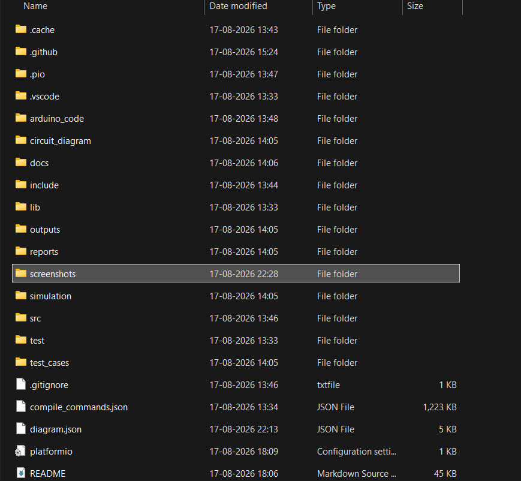

### 🔧 Complete Wokwi Circuit Wiring Diagram
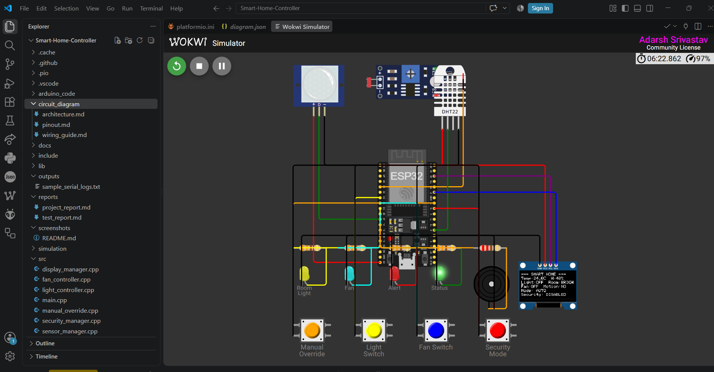

### 🖥️ OLED Boot Splash Screen
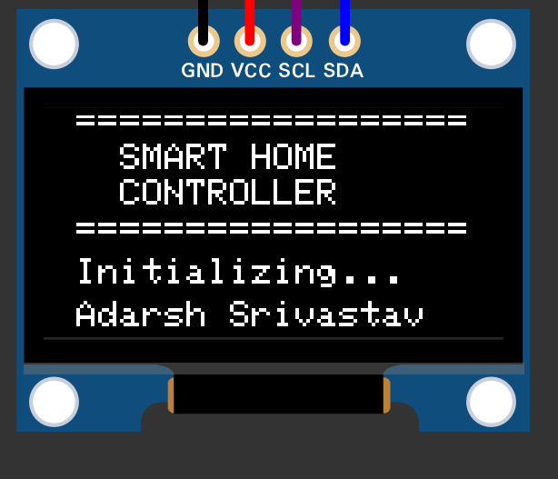

### ☀️ Bright Room Idle State (Light OFF)
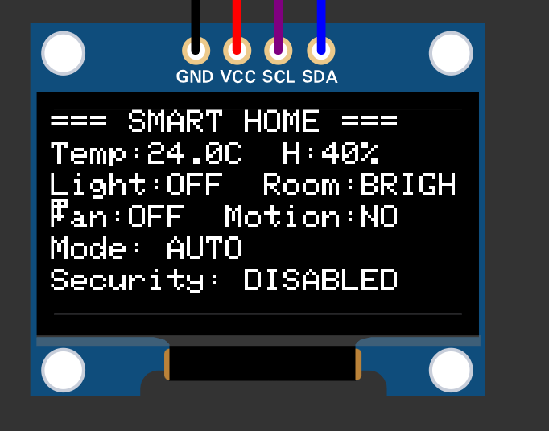

### 🌙 Dark Room + Motion → Light ON
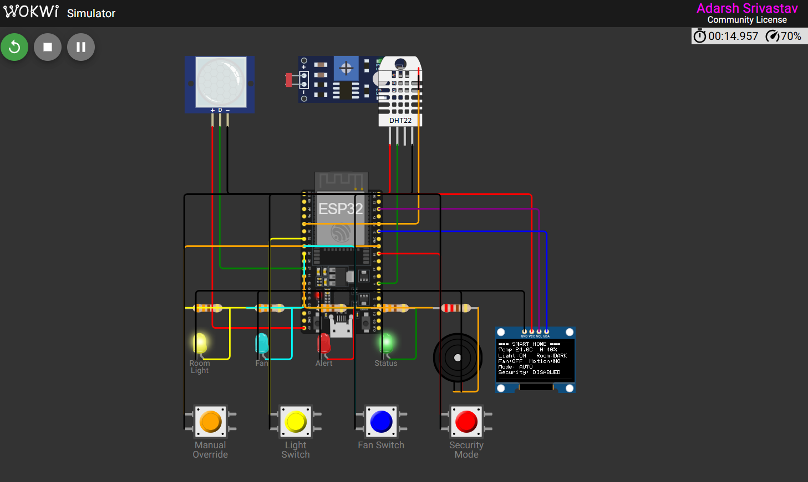

### 🌡️ High Temperature → Fan ON
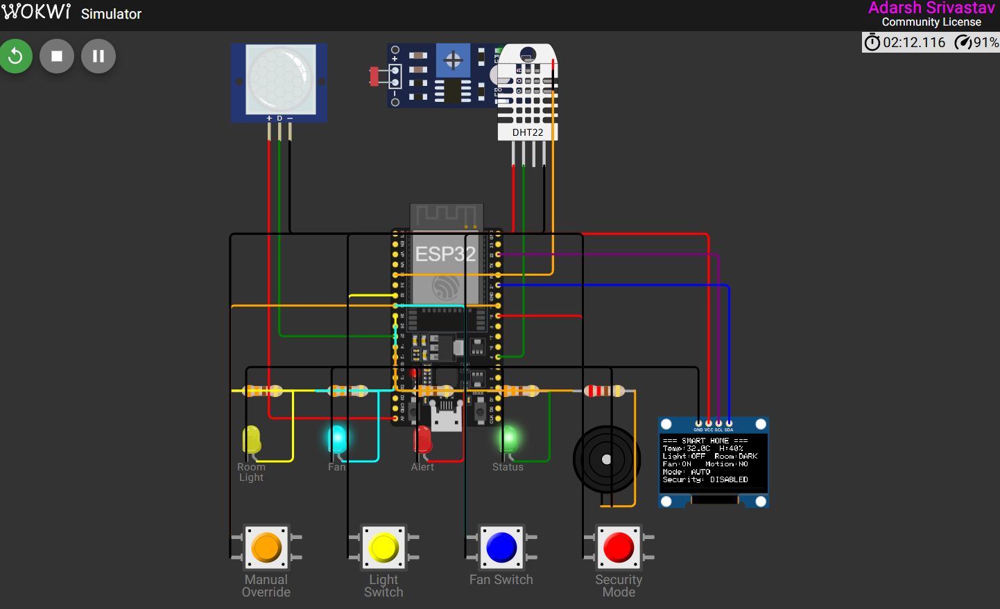

### ❄️ Normal Temperature → Fan OFF (Hysteresis)
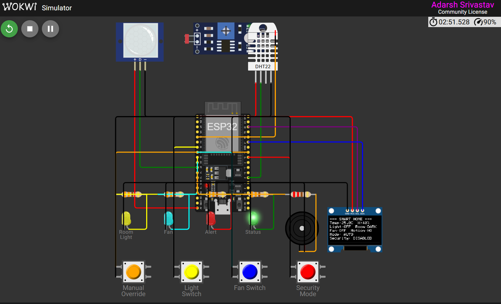

### 🔐 Security Armed State
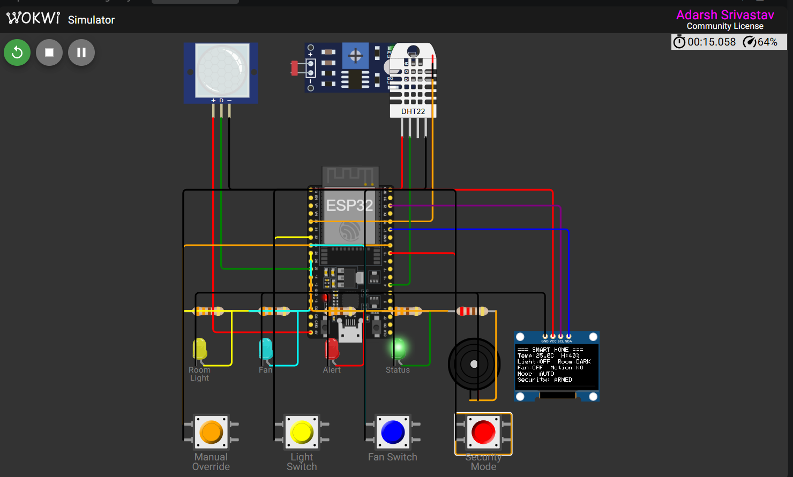

### 🚨 Intruder Alert Active (Buzzer + Red LED)
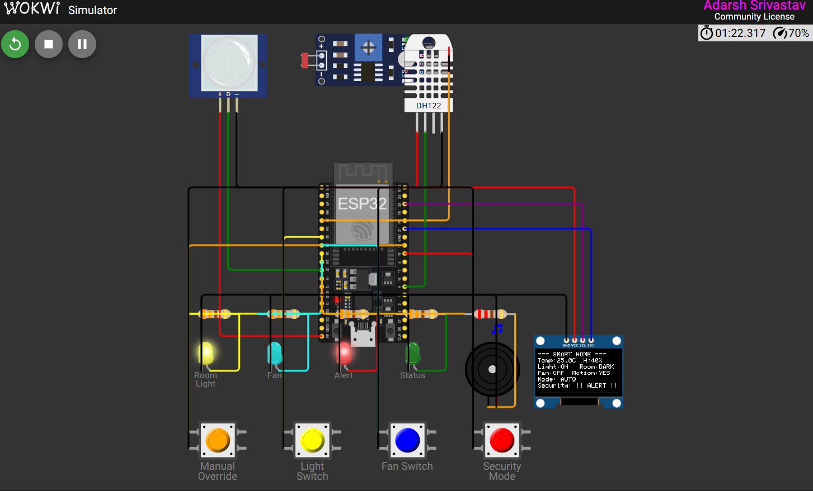

### 🔒 Alert Latching (Motion Stopped, Alarm Persists)


### 🎛️ Manual Override Mode Active
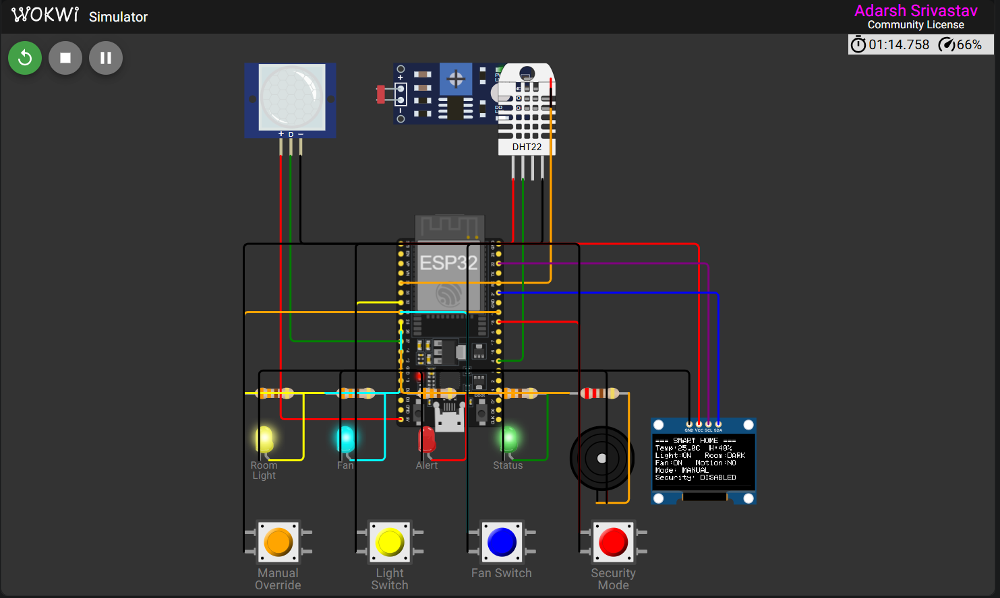

### 📟 OLED Status Display (AUTO Mode)
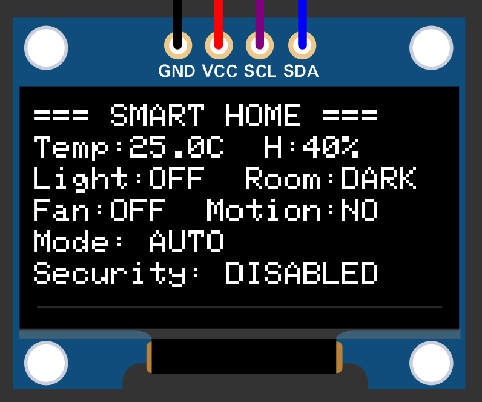

### 📟 OLED Status Display (MANUAL Mode)
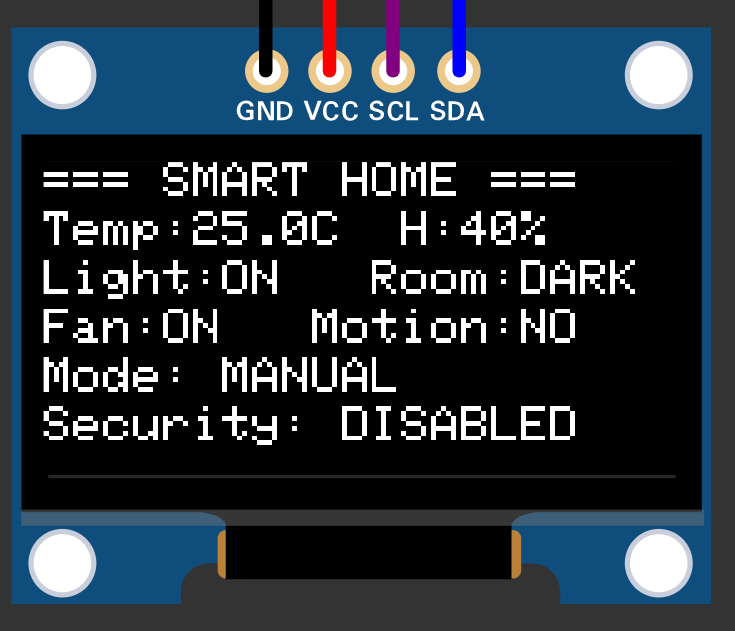

### ⚠️ OLED Intruder Alert Display
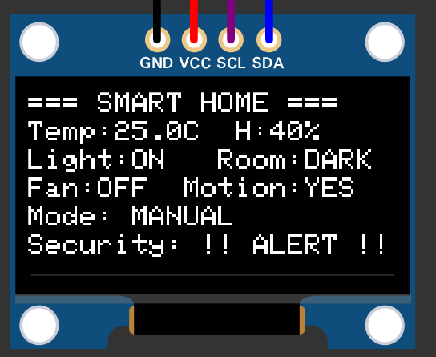

### 🔥 Critical Temperature Alert (≥ 45°C)
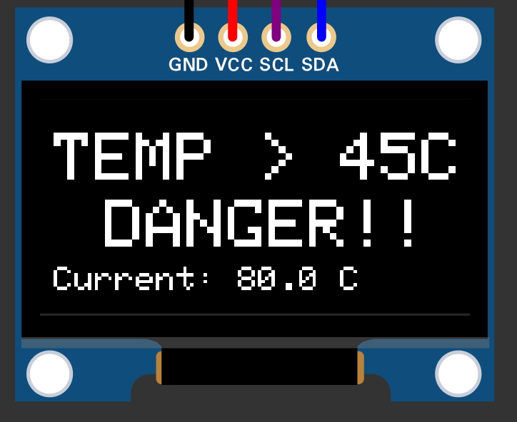

### 💻 Modular C++ Source Code in VS Code
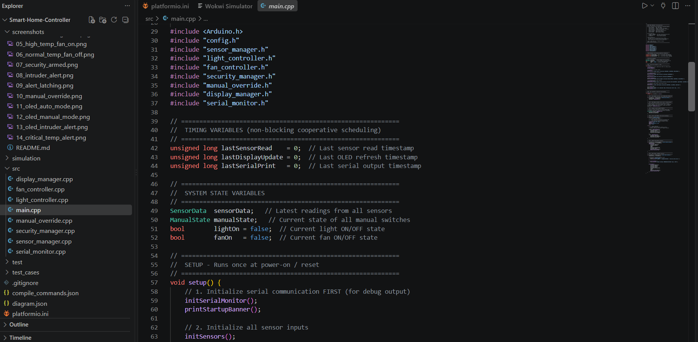

### 🌐 GitHub Repository Homepage Preview
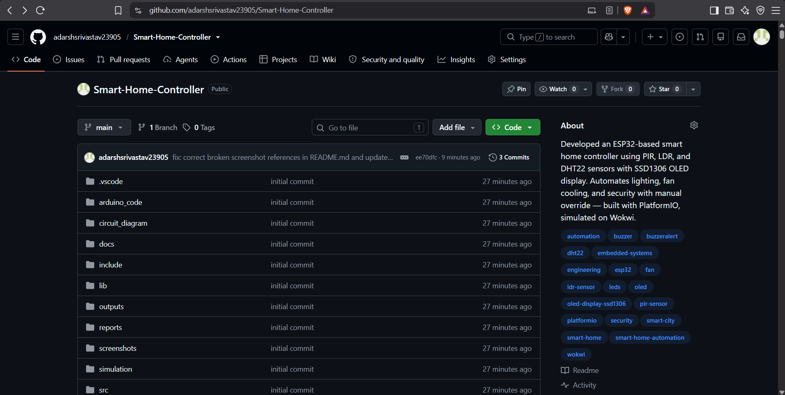

---

## 📁 Project Directory Structure

```text
Smart-Home-Controller/
├── .vscode/                    # VS Code workspace settings and IntelliSense
├── arduino_code/               # Standalone monolithic Arduino sketch
│   └── smart_home_controller.ino  # Single-file code for Arduino IDE (with OLED)
├── circuit_diagram/            # Schematics, pinout tables, wiring documentation
│   ├── architecture.md         # Architectural overview, I/O tables, timing tables
│   ├── pinout.md               # Detailed hardware pin mapping table
│   └── wiring_guide.md         # Step-by-step breadboard wiring instructions
├── docs/                       # Engineering documentation and design specifications
│   ├── automation_logic.md     # Automation rules, decision tables, FSM diagrams
│   ├── embedded_concepts.md    # 22 embedded concepts explained with project context
│   ├── github_strategy.md      # GitHub upload strategy and commit history plan
│   ├── hardware_components.md  # Detailed component specifications and datasheets
│   ├── implementation_phases.md# 15-phase implementation methodology
│   ├── interview_prep.md       # 10 Q&A + 5 bonus interview questions
│   ├── limitations.md          # Known limitations and future improvement roadmap
│   ├── project_explanation.md  # Simple + technical project explanations
│   ├── requirements.md         # Software, hardware, and system requirements
│   └── tech_stack_options.md   # 3 implementation options (Easy/Recommended/Advanced)
├── include/                    # Modular C++ header files (PlatformIO)
│   ├── config.h                # Central pin assignments, thresholds, timing constants
│   ├── display_manager.h       # SSD1306 OLED I2C driver header
│   ├── fan_controller.h        # Temperature-based fan control header
│   ├── light_controller.h      # Motion + darkness light control header
│   ├── manual_override.h       # Push button switch reader header
│   ├── security_manager.h      # 3-state security FSM header
│   ├── sensor_manager.h        # PIR/LDR/DHT22 sensor acquisition header
│   └── serial_monitor.h        # UART telemetry output header
├── outputs/                    # Captured serial logs and telemetry outputs
│   └── sample_serial_logs.txt  # Representative serial monitor capture
├── reports/                    # Formal project testing and academic reports
│   ├── project_report.md       # Complete academic project report (23 sections)
│   └── test_report.md          # Detailed test execution report with results
├── screenshots/                # Wokwi simulation evidence and screenshot proof
│   └── README.md               # 17-item screenshot checklist with filenames
├── simulation/                 # Virtual simulation guide and scenario files
│   ├── README.md               # Step-by-step Wokwi execution guide (17 steps)
│   └── test_scenarios.md       # 8 comprehensive simulation test scenarios
├── src/                        # Modular C++ source files (PlatformIO)
│   ├── display_manager.cpp     # SSD1306 OLED rendering implementation
│   ├── fan_controller.cpp      # Temperature hysteresis fan control logic
│   ├── light_controller.cpp    # Motion + LDR automatic lighting logic
│   ├── main.cpp                # Main application orchestrator (setup + loop)
│   ├── manual_override.cpp     # Debounced push button reading logic
│   ├── security_manager.cpp    # 3-state FSM with latching alarm
│   ├── sensor_manager.cpp      # PIR/LDR/DHT22 data acquisition
│   └── serial_monitor.cpp      # Formatted UART telemetry output
├── test_cases/                 # Testing strategy and verification matrix
│   └── test_matrix.md          # 20 test cases + debugging guide
├── .gitignore                  # Git ignore configuration
├── diagram.json                # Wokwi circuit topology definition
├── platformio.ini              # PlatformIO build environment and dependencies
├── wokwi.toml                  # Wokwi VS Code simulator configuration
└── README.md                   # This master project documentation
```

---

## ▶️ How to Run the Project

### Method A: Wokwi Virtual Simulation (Recommended — 100% Free)

1. Open [Wokwi.com](https://wokwi.com/) or open this repository in VS Code with the **Wokwi Simulator** extension.
2. The circuit topology is defined in [`diagram.json`](diagram.json) with ESP32 + PIR + LDR + DHT22 + OLED + LEDs + Buzzer + Buttons.
3. Click **Start Simulation**.
4. Observe the OLED display boot message: `SMART HOME / CONTROLLER / Initializing...`
5. **Test Lighting**: Click the LDR to set it to dark (low value), then click the PIR sensor. Verify the Yellow LED turns ON.
6. **Test Fan**: Click the DHT22 and slide temperature above 30°C. Verify the Cyan LED turns ON.
7. **Test Security**: Click the Security button, then trigger PIR motion. Verify Buzzer pulses and Red LED turns ON.
8. **Test Manual Override**: Click the Override button. Click Light/Fan buttons. Verify LEDs follow button state.
9. Open the **Serial Monitor** at **115200 baud** to view telemetry.

### Method B: Physical Hardware Setup (Arduino IDE / PlatformIO)

1. Wire all components according to the [Pin Configuration](#-pin-configuration) table and [`circuit_diagram/wiring_guide.md`](circuit_diagram/wiring_guide.md).
2. **For Arduino IDE**: Open [`arduino_code/smart_home_controller.ino`](arduino_code/smart_home_controller.ino), install required libraries via Library Manager, select "ESP32 Dev Module" board, and upload.
3. **For PlatformIO**: Open this project folder in VS Code. PlatformIO will auto-install dependencies from [`platformio.ini`](platformio.ini). Click the Upload button (→) in the bottom taskbar.
4. Open the **Serial Monitor** at **115200 Baud Rate**.
5. Test individual sensors first, then integrated automation.

### Required Libraries (Arduino IDE)
Install via **Sketch → Include Library → Manage Libraries**:
- `DHT sensor library` by Adafruit
- `Adafruit Unified Sensor` by Adafruit
- `Adafruit SSD1306` by Adafruit
- `Adafruit GFX Library` by Adafruit

---

## 🏭 Industry Applications

The logic, state machines, and sensor integrations demonstrated in this project form the foundation of real-world industrial systems:

| Industry / Domain | Application of Similar Logic |
|---|---|
| **Smart Homes** | Automated HVAC, smart lighting, and occupancy-based climate control |
| **Smart Buildings** | Occupancy sensors for energy-compliant lighting (Title 24) in corporate offices |
| **Offices** | Meeting room automation — lights/ACs off when unoccupied |
| **Hotels** | Automated guest room comfort with motion-activated amenities |
| **Hospitals** | Patient ward environmental monitoring and sterile environment lighting |
| **Shopping Malls** | Zone-based lighting and climate control for energy optimization |
| **Industrial Automation** | Automated exhaust fans based on machinery temperature |
| **Building Management (BMS)** | Centralized HVAC, fire alarm, and access control integration |
| **Energy Management** | Real-time load shedding during peak tariff hours |
| **Security Systems** | Multi-zone latching alarm systems for data centers and server rooms |
| **Agriculture/Greenhouses** | Automated ventilation driven by temperature and irradiance sensors |
| **Automotive ECUs** | Priority-based interrupt logic (ABS/Airbags override infotainment) |
| **Cold Chain Logistics** | Temperature monitoring for pharmaceutical storage compliance |
| **Smart City Streetlights** | Ambient light thresholding for autonomous road illumination |

---

## 📈 Embedded Systems Concepts Demonstrated

| Concept | How It's Used in This Project |
|---|---|
| **Microcontroller (ESP32)** | Central processing unit executing firmware, reading sensors, driving outputs |
| **GPIO Configuration** | Mapping 14+ pins across Input, Output, ADC, and I2C domains |
| **Digital Input** | Reading PIR sensor state and push button states via `digitalRead()` |
| **Digital Output** | Driving LEDs and buzzer via `digitalWrite()` HIGH/LOW |
| **Analog Input** | Reading LDR voltage via ESP32's 12-bit ADC on GPIO 34 |
| **ADC (Analog-to-Digital)** | Converting continuous LDR voltage to 0-4095 digital values |
| **PWM (Concept)** | Foundation for future variable-speed fan control upgrade |
| **Sensors** | PIR (infrared motion), LDR (photoresistance), DHT22 (capacitive/thermistor) |
| **Actuators** | LEDs (visual), Active Buzzer (acoustic) simulating real loads |
| **Relay (Concept)** | LEDs simulate relay-controlled mains appliances for safety |
| **Threshold Logic** | Boolean comparisons: `ldrValue < 1000`, `temperature >= 30.0` |
| **Conditional Statements** | `if/else` branching for automation rules and priority handling |
| **Non-blocking Timing** | `millis()` instead of `delay()` for cooperative multitasking |
| **Serial Communication (UART)** | Formatted telemetry at 115200 baud via `Serial.print()` |
| **I2C Protocol** | SSD1306 OLED communication on SDA (GPIO 21) / SCL (GPIO 22) |
| **One-Wire Protocol** | DHT22 proprietary 40-bit data frame communication |
| **State Machine (FSM)** | Security system: DISABLED → ARMED → ALERT with latching |
| **Hysteresis** | 2°C dead-band prevents fan relay chattering near threshold |
| **Manual Override** | Priority flags bypass sensor logic for direct user control |
| **INPUT_PULLUP** | Internal 45kΩ pull-up resistors eliminate external components |
| **Switch Debouncing** | 50ms software debounce filters mechanical bounce artifacts |
| **Interrupts (Concept)** | PIR could wake ESP32 from deep sleep (future enhancement) |

---

## ⚠️ Limitations

1. **No Network Connectivity**: System operates 100% offline — no Wi-Fi, MQTT, or smartphone integration.
2. **Volatile Memory**: Security states and sensor histories are lost upon power failure (no EEPROM/Flash storage).
3. **Software Debouncing Only**: No hardware RC low-pass filters; software debounce may be insufficient in electrically noisy environments.
4. **Simulated Loads**: LEDs simulate appliances — driving real 220V AC requires proper relay modules with optical isolation.
5. **Fixed Thresholds**: Temperature and light thresholds are hardcoded in `config.h` — changing requires recompilation.
6. **Single Zone**: Accommodates one room only — multi-room scaling requires sensor arrays and zone management.
7. **No Sensor Filtering**: LDR uses single-sample `analogRead()` — susceptible to flickering light or temporary shadows.
8. **Display Density**: 0.96" OLED (128×64) limits information density for complex dashboards.
9. **Virtual Prototype Only**: Tested exclusively in Wokwi — lacks real-world EMI and power supply noise testing.

---

## 🚀 Future Improvements

1. **Wi-Fi & MQTT Integration** — Enable ESP32 to publish telemetry to an MQTT broker for cloud connectivity.
2. **Home Assistant Compatibility** — Auto-discover devices via MQTT integration.
3. **Mobile Dashboard** — Web-based UI using ESPAsyncWebServer for local browser control.
4. **Non-Volatile Storage** — Save thresholds to ESP32 Flash/SPIFFS for persistence across reboots.
5. **Dynamic OLED Menu** — Navigate and adjust thresholds via push buttons without a computer.
6. **Voice Control** — Integrate with Alexa/Google Home via simulated Wemo/Hue protocols.
7. **Real-Time Clock (RTC)** — DS3231 module for time-based scheduling (e.g., lights off at 11 PM).
8. **PWM Fan Speed Control** — Variable speed based on temperature deviation magnitude (PID control).
9. **Data Logging** — Log historical events to micro-SD card for analysis.
10. **Over-The-Air (OTA) Updates** — Flash new firmware wirelessly without USB.

---

## 📚 Learning Outcomes

By completing and studying this project, students and developers will learn how to:
- Architect a complete embedded C++ application from scratch with modular design.
- Interface with diverse hardware protocols (Analog, Digital, I2C, One-Wire) simultaneously.
- Write robust, non-blocking code that avoids the pitfalls of `delay()`.
- Translate abstract concepts like Hysteresis and State Machines into concrete C++ logic.
- Implement priority-based control hierarchies used in industrial automation.
- Debug complex hardware interactions using structured Serial prints and logical deduction.
- Design safe prototyping circuits using LEDs as simulated loads.
- Create professional, industry-standard documentation that communicates engineering decisions.

---

## 👨‍🎓 Author Information

**Adarsh Srivastav**  
Computer Science and Engineering (CSE) Student  
**Specializations:** Embedded Systems | IoT | Python | Microcontroller Firmware | AI

---

**Project Status: ✅ Functional Virtual Prototype | 🧪 Validated in Wokwi with SSD1306 OLED | 🚀 Ready for GitHub**
