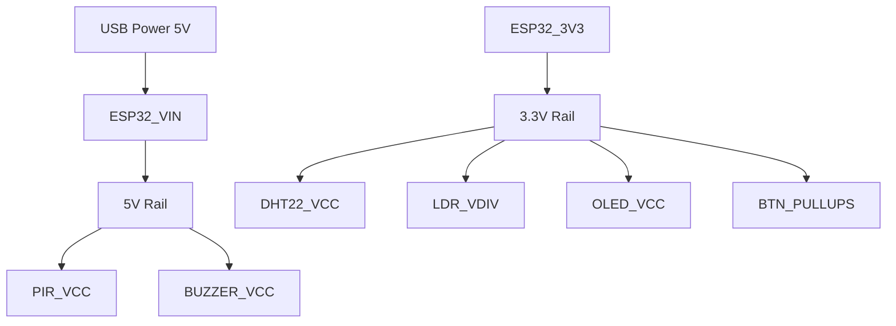

# Pinout Mapping

## Complete ESP32 Pin Mapping Table

| Component | Signal | ESP32 GPIO | Direction | Type | Notes |
|-----------|--------|------------|-----------|------|-------|
| PIR Sensor | OUT | GPIO 27 | Input | Digital | HC-SR501 |
| LDR Sensor | V_out | GPIO 34 | Input | Analog | ADC1_CH6, 12-bit |
| DHT22 | DATA | GPIO 4 | In/Out | One-Wire | Requires pull-up (internal/external) |
| Yellow LED | Anode | GPIO 25 | Output | Digital | Room Light. Series 330Ω resistor. |
| Cyan LED | Anode | GPIO 26 | Output | Digital | Fan. Series 330Ω resistor. |
| Buzzer | Positive | GPIO 14 | Output | Digital | Active buzzer |
| Red LED | Anode | GPIO 12 | Output | Digital | Alert. Series 330Ω resistor. |
| Green LED | Anode | GPIO 13 | Output | Digital | Status. Series 330Ω resistor. |
| OLED Display| SDA | GPIO 21 | Bidirect. | I2C | Address 0x3C |
| OLED Display| SCL | GPIO 22 | Output | I2C | |
| Override Btn| Terminal | GPIO 19 | Input | Digital | Uses `INPUT_PULLUP` |
| Light Btn | Terminal | GPIO 32 | Input | Digital | Uses `INPUT_PULLUP` |
| Fan Btn | Terminal | GPIO 33 | Input | Digital | Uses `INPUT_PULLUP` |
| Security Btn| Terminal | GPIO 18 | Input | Digital | Uses `INPUT_PULLUP` |
| All Modules | VCC | 3.3V / 5V | Power | Power | See distribution below |
| All Modules | GND | GND | Power | Ground | Common ground required |

## Power Distribution Diagram

## Special Configurations
- **ADC Channel Mapping**: LDR uses GPIO 34 which is ADC1_CH6. ADC1 is safe to use with WiFi/Bluetooth active.
- **I2C Bus Addressing**: OLED SSD1306 uses standard I2C address 0x3C on pins 21 (SDA) and 22 (SCL).
- **Pull-up/Pull-down Configuration**: All mechanical push buttons utilize internal pull-up resistors (`INPUT_PULLUP`). They are wired to GND and will read `LOW` when pressed.
