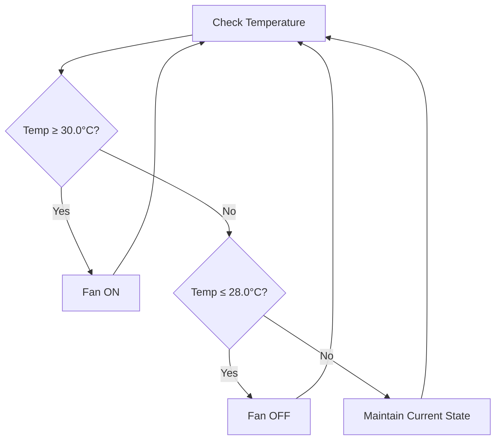
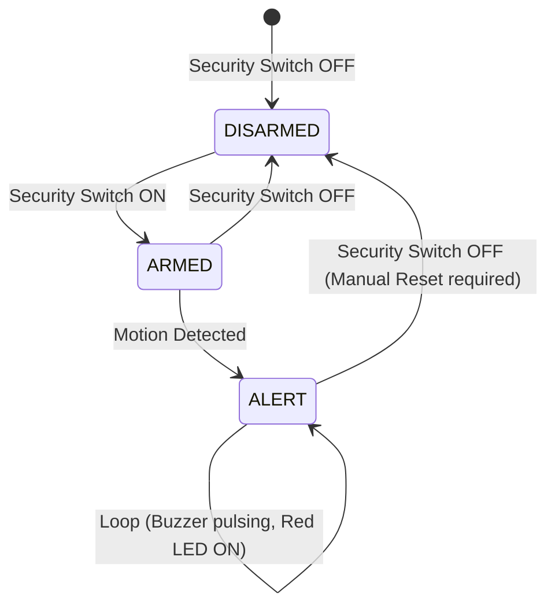

# System Automation Logic & Control Rules

This document outlines the core operational logic of the Smart Home Controller. The system operates on a prioritized, event-driven architecture relying on sensor inputs to make automated decisions, while providing manual control capabilities and a critical security override.

## Priority Hierarchy

The system evaluates conditions based on the following priority hierarchy, ensuring that critical functions override non-critical ones.

1. **SECURITY ALERT (Highest Priority)** — Overrides all other states. When security mode is active and an intrusion is detected, manual switches and environmental controls are ignored to execute safety procedures.
2. **MANUAL OVERRIDE (Medium Priority)** — Provides the user with direct control. Bypasses the automatic sensor-driven logic for lights and fans.
3. **AUTOMATIC MODE (Lowest Priority)** — The default operational state. Relies purely on environmental sensor data (LDR, DHT22, PIR) to manage room conditions dynamically.

---

## Rule 1 – Automatic Light Control

The smart lighting system utilizes both a Passive Infrared (PIR) motion sensor and a Light Dependent Resistor (LDR) to ensure energy efficiency.

### Logic Rules
```text
IF Motion = Detected AND Room = Dark THEN Light = ON
IF No Motion for 30 seconds THEN Light = OFF
IF Motion = Detected AND Room = Bright THEN Light = OFF (natural light sufficient)
```

> [!TIP]
> **Timeout Mechanism using `millis()`**
> Instead of using blocking `delay()` functions, the system uses the non-blocking `millis()` function to track time. When motion is detected, a variable `lastMotionTime` is updated to the current `millis()` value. During each loop iteration, the system checks:
> `if (millis() - lastMotionTime >= MOTION_TIMEOUT) { turnLightOff(); }`
> This allows the controller to simultaneously monitor other sensors and update the display without freezing.

---

## Rule 2 – Automatic Fan Control with Hysteresis

To prevent rapid on/off switching (chattering) when the temperature hovers precisely at a threshold, a hysteresis band is implemented.

### Logic Rules
```text
IF Temperature ≥ 30.0°C THEN Fan = ON
IF Temperature ≤ 28.0°C THEN Fan = OFF
IF 28.0°C < Temperature < 30.0°C THEN Maintain current state (dead-band)
```

### Mathematical Model of Hysteresis

The dead-band range is defined by the equation:
$$\Delta T = T_{ON} - T_{OFF} = 30.0 - 28.0 = 2.0^\circ C$$

Within the $\Delta T$ dead-band, the fan state depends on its previous state. If it was already cooling down from a higher temperature, it remains ON until it hits $T_{OFF}$. If the temperature is rising from below, it stays OFF until it reaches $T_{ON}$.

> [!NOTE]
> **Hysteresis Flowchart**


---

## Rule 3 – Security System (3-State FSM with Latching)

The security mode operates as a Finite State Machine (FSM). When armed, any motion triggers a latched alarm state that cannot reset itself automatically.

### Logic Rules
```text
IF Security Mode = ON AND Motion = Detected THEN:
  - State = ALERT (LATCHED)
  - Buzzer = PULSING (500ms ON/OFF)
  - Red LED = ON
  - Green LED = OFF  
  - OLED = "!! ALERT !!"
  - Light = FORCED ON
  - Fan = FORCED OFF
Alarm remains LATCHED until user turns OFF Security Mode switch
```

### State Machine Diagram



> [!IMPORTANT]
> The alarm is intentionally **latched**. Even if the intruder leaves the motion sensor's range, the alarm will continue pulsing until a user physically disables the security switch.

---

## Rule 4 – Manual Override

Provides manual control for user comfort, bypassing environmental sensors.

### Logic Rules
```text
IF Manual Override Switch = PRESSED THEN:
  - Light follows Manual Light Switch
  - Fan follows Manual Fan Switch
  - Automatic sensor logic is bypassed
```

---

## Complete Decision Table

The table below covers 10 representative system states evaluating inputs against expected outputs.

| Security Mode | Motion | Override | Manual Light | Manual Fan | Room Dark | Temp ≥ 30°C | → Light | → Fan | → Buzzer | → Red LED | → Green LED | → OLED Display |
|:---:|:---:|:---:|:---:|:---:|:---:|:---:|:---:|:---:|:---:|:---:|:---:|---|
| OFF | No | OFF | - | - | Yes | No | OFF | OFF | OFF | OFF | ON | Normal Status |
| OFF | Yes | OFF | - | - | Yes | No | ON | OFF | OFF | OFF | ON | "Light ON (Auto)" |
| OFF | Yes | OFF | - | - | No | No | OFF | OFF | OFF | OFF | ON | "Room Bright" |
| OFF | No | OFF | - | - | Yes | Yes | OFF | ON | OFF | OFF | ON | "Fan ON (Auto)" |
| OFF | Yes | OFF | - | - | Yes | Yes | ON | ON | OFF | OFF | ON | "Light/Fan ON" |
| OFF | X | ON | ON | OFF | X | X | ON | OFF | OFF | OFF | ON | "Override Active" |
| OFF | X | ON | OFF | ON | X | X | OFF | ON | OFF | OFF | ON | "Override Active" |
| ON | No | X | X | X | X | X | OFF | OFF | OFF | OFF | ON | "SEC: ARMED" |
| ON | Yes | X | X | X | X | X | ON | OFF | PULSE | ON | OFF | "!! ALERT !!" |
| ON | No (Latched) | X | X | X | X | X | ON | OFF | PULSE | ON | OFF | "!! ALERT !!" |

*(X = Don't Care)*
