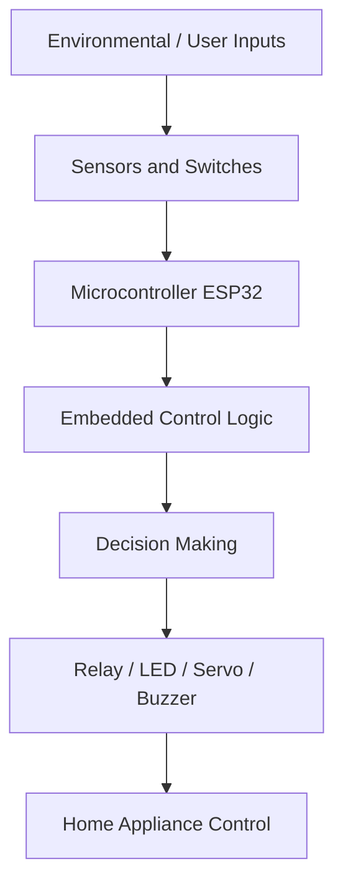

# Smart Home Controller: Project Explanation

## Section 1: PROJECT EXPLANATION

### A. Simple Explanation

**What is a Smart Home Controller?**
A Smart Home Controller is a centralized electronic system that automates and manages various appliances and environmental parameters within a home. Imagine having a digital brain for your house that can observe the environment using its "senses" (sensors) and act upon it using its "hands" (actuators). Instead of walking over to flip a switch when it gets dark, the house detects the darkness and turns the light on for you.

**What real-world problem does it solve?**
In our daily lives, we waste a significant amount of energy by leaving lights and fans on when they are not needed. Furthermore, managing home security, maintaining a comfortable room temperature, and remembering to turn off appliances can be tedious. A Smart Home Controller solves these problems by minimizing human intervention, reducing energy consumption, and enhancing the overall safety and comfort of the living space. 

**What is home automation?**
Home automation refers to the automatic and electronic control of household features, activities, and appliances. In a fully automated home, various devices communicate with each other and with a central controller to operate seamlessly. This can range from simple timed events (like turning off a light after 30 minutes) to complex reactive systems (like turning on an exhaust fan only when the temperature is high and motion is detected).

**Analogies to Understand Better**
- **Sensors = Eyes and Skin:** Just as our eyes detect light and our skin feels temperature, sensors like the LDR (Light Dependent Resistor) and DHT22 measure the physical world.
- **Microcontroller (ESP32) = Brain:** The central processing unit takes the input from the senses, processes it based on learned rules (the code), and decides what to do.
- **Actuators/Relays = Hands and Muscles:** Once the brain decides to turn on a fan, it sends a signal to the relay, which physically flips the switch, just like your hand would.

### B. Technical Explanation

**How Sensors Communicate with a Microcontroller**
Sensors interact with the microcontroller unit (MCU) using different signaling methods. 
- **Digital Signaling:** Devices like the HC-SR501 PIR motion sensor output discrete digital signals (HIGH or LOW). When motion is detected, the sensor's output pin is pulled to 3.3V (Logic 1); otherwise, it remains at 0V (Logic 0).
- **Analog Signaling:** The LDR provides a continuous voltage level that varies with light intensity. The ESP32's built-in 12-bit Analog-to-Digital Converter (ADC) reads this voltage and translates it into a digital value ranging from 0 to 4095.
- **Digital Protocols:** The DHT22 temperature and humidity sensor uses a proprietary one-wire serial protocol to transmit structured 40-bit data frames to the MCU.

**How a Microcontroller Makes Control Decisions**
The microcontroller executes an infinite loop (the `loop()` function in Arduino) where it continuously polls sensor data and evaluates it against predefined rules. 
- **Threshold Comparison:** The MCU compares the ADC value of the LDR against `LDR_DARK_THRESHOLD` (1000). If the reading falls below this threshold, it infers that it is dark.
- **State Machines:** The security system is modeled as a finite state machine (FSM) with states like `DISABLED`, `ARMED`, and `ALERT`. The system transitions between these states based on button presses (to arm/disarm) and sensor triggers (PIR motion detection while armed).

**How Appliances Can Be Automatically Controlled**
Microcontrollers operate at low voltage and current levels (e.g., 3.3V, 20mA), which are insufficient to drive mains-powered AC appliances (e.g., 220V fans). To bridge this gap, the MCU's GPIO (General Purpose Input/Output) pins are used to drive relays. A relay is an electromechanical switch. When the GPIO outputs a HIGH signal, it energizes the relay coil, closing the high-voltage circuit and turning on the appliance. In this student project, LEDs are used to safely simulate these high-power loads.

**How Manual and Automatic Modes Work Together**
A robust embedded system must account for user intervention. This project implements a priority hierarchy where manual control overrides automatic logic. If a user presses the manual override button, the system bypasses sensor-driven logic (e.g., turning on the light even if it is daytime) and relies on the manual switches for light and fan control. This is achieved using state variables that track the current operational mode.

**Demonstration of Embedded Systems Concepts**
This project serves as a comprehensive demonstration of core embedded systems principles:
- Hardware-software co-design.
- Real-time data acquisition and signal processing.
- Non-blocking timing using cooperative multitasking.
- Serial communication protocols (I2C for OLED, UART for debugging).
- User interface design (push buttons and OLED displays).

**Workflow Diagram**

## Section 2: INDUSTRY RELEVANCE

**Application in Various Sectors**
Embedded systems identical in principle to this Smart Home Controller are ubiquitously deployed across multiple industries:
- **Smart Homes & Buildings:** For automated HVAC (Heating, Ventilation, and Air Conditioning) control, smart lighting, and automated blind systems.
- **Offices & Commercial Spaces:** Utilizing occupancy sensors to turn off lights and ACs in empty meeting rooms to save operational costs.
- **Hotels & Hospitals:** Implementing room automation for guest comfort and integrating environmental monitoring for sensitive equipment or patient wards.
- **Industrial Automation & BMS:** Building Management Systems (BMS) scale these concepts to control entire skyscrapers, integrating fire alarms, security, and climate control into a centralized dashboard.
- **Energy Management Systems:** Monitoring real-time energy usage and shedding non-critical loads during peak tariff hours.
- **Security Systems:** Integrating motion sensors, door/window contacts, and biometric access controls to safeguard premises.

**Business Value**
The commercial deployment of such systems offers immense business value:
- **Energy Saving:** By ensuring that appliances are only active when necessary, electricity wastage is drastically reduced, leading to lower utility bills.
- **Convenience & Automation:** Automating routine tasks improves quality of life and allows human operators to focus on more complex tasks.
- **Safety & Security Monitoring:** Instant alerts on critical events (like high temperatures or unauthorized motion) prevent accidents, theft, and equipment damage.
- **Centralized Control:** Facility managers can monitor and control a massive infrastructure from a single pane of glass.
- **Improved User Experience:** In hospitality and retail, responsive environments (like automatic lighting and temperature adjustment) significantly enhance customer satisfaction.

**Career Relevance**
Building this project develops highly marketable skills for various engineering roles:
- **Embedded Systems Engineer:** Designing the core logic and integrating MCU hardware with peripherals.
- **Firmware Engineer:** Writing robust, non-blocking C/C++ code that runs on resource-constrained devices.
- **IoT Engineer:** Expanding the local controller to communicate with cloud platforms via Wi-Fi/MQTT.
- **Electronics Engineer:** Designing the PCB, sensor interfacing circuits, and power distribution systems.
- **Automation Engineer:** Defining the logic gates and control loops that drive industrial processes.
- **Hardware-Software Integration Engineer:** Bridging the gap between physical hardware components and the software stack that governs them.

> [!NOTE]
> The principles learned in this seemingly simple Smart Home project are the exact same principles used to design the electronic control units (ECUs) in modern electric vehicles, aerospace systems, and medical devices.

> [!TIP]
> Emphasize your understanding of non-blocking code and state machines during job interviews, as these are critical competencies in professional embedded development.
