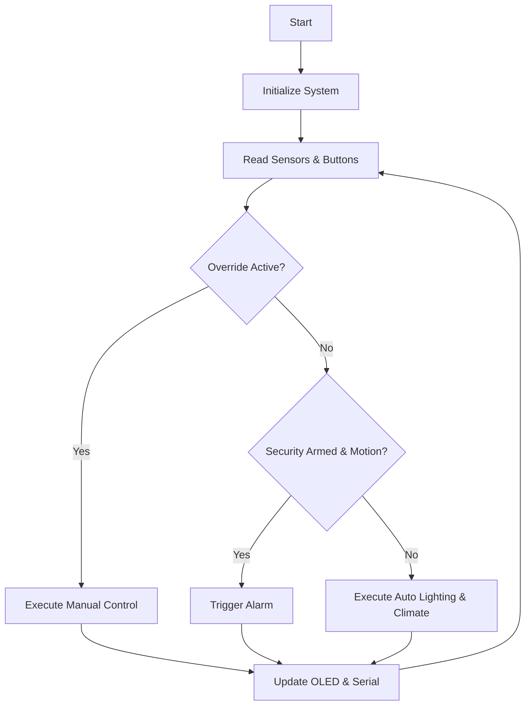

# Smart Home Controller
## Academic Project Report

**Author:** Adarsh Srivastav (Computer Science and Engineering Student)
**Platform:** ESP32 DevKit V4
**Framework:** Arduino / PlatformIO
**Simulation:** Wokwi

---

### 1. Abstract
The rapid advancement of Internet of Things (IoT) technologies has revolutionized how we interact with our living spaces. This project presents the design and implementation of a comprehensive Smart Home Controller using the ESP32 microcontroller. The system integrates environmental monitoring and automated actuation to improve energy efficiency, enhance security, and provide user convenience. Key features include motion-activated lighting based on ambient light levels (using PIR and LDR sensors), temperature-dependent ventilation with hysteresis control (using DHT22), and a robust, latching security alarm system. An OLED display provides real-time telemetry, while manual override switches allow users to bypass automation when necessary. The system architecture is highly modular, programmed in C++ using the Arduino framework via PlatformIO, and validated extensively using the Wokwi simulation environment. This project demonstrates foundational embedded systems principles, including sensor interfacing, state machine logic, analog-to-digital conversion, and I2C communication, resulting in a reliable and scalable prototype for home automation.

### 2. Introduction
Home automation is transitioning from a luxury to a necessity, driven by the need for energy conservation, security, and convenience. Traditional home environments rely heavily on manual intervention for lighting, climate control, and security, often leading to wasted electricity and compromised safety when human error occurs. While commercial systems exist, they are often proprietary, expensive, and require internet connectivity. This project aims to build a localized, autonomous Smart Home Controller that operates efficiently without relying on cloud infrastructure, making it an ideal learning platform for understanding the core mechanisms of embedded automation.

### 3. Problem Statement
Current residential spaces suffer from inefficiencies such as lights left on in empty rooms or during daylight hours, and fans running when temperatures are low. Furthermore, basic security systems lack integration with home automation. The absence of automated, intelligent control leads to unnecessary energy consumption and increased utility costs. There is a need for a unified embedded system that intelligently monitors the environment (motion, light, temperature) and acts accordingly while still allowing manual user control and providing visual status updates.

### 4. Objectives
1. To design an embedded smart home system using the ESP32 microcontroller.
2. To implement automatic lighting control using a PIR motion sensor and an LDR (Light Dependent Resistor).
3. To develop an intelligent fan control mechanism using a DHT22 temperature sensor with a 2°C hysteresis.
4. To integrate a 3-state latching security alarm system with visual and auditory feedback.
5. To provide real-time system telemetry via an I2C OLED display (128x64).
6. To implement a manual override feature utilizing physical switches with debounce logic.
7. To design a modular, object-oriented C++ software architecture.
8. To validate the system functionality using the Wokwi simulation platform.
9. To optimize energy consumption by turning off appliances when not needed.
10. To ensure the system operates entirely offline, ensuring privacy and reliability.

### 5. Literature Review / Existing Systems
Commercial smart home systems like Google Nest, Amazon Ring, and Samsung SmartThings dominate the market. While powerful, these systems rely heavily on cloud servers, making them vulnerable to internet outages and privacy concerns. Furthermore, their closed-source nature makes them unsuitable for educational purposes. 

Previous academic projects often utilize basic microcontrollers like the Arduino Uno, which lacks the processing power and future scalability (like Wi-Fi/Bluetooth) required for modern IoT. By selecting the ESP32, this project bridges the gap between basic microcontroller projects and advanced IoT systems.

### 6. Proposed System
The proposed Smart Home Controller is a localized embedded system built around the ESP32. What makes it unique as a learning platform is its comprehensive integration of diverse embedded concepts: digital/analog inputs, one-wire protocols, I2C displays, non-blocking timing (`millis()`), state machines, and hardware interrupts (or polled debouncing). It serves as a foundational template that can be easily expanded into a full IoT device in the future.

### 7. Hardware Components

| Component | Description | Pin Mapping | Purpose |
|---|---|---|---|
| ESP32 DevKit V4 | 32-bit Microcontroller | - | Main processing unit |
| HC-SR501 | PIR Motion Sensor | GPIO 27 (Digital In) | Detects human presence |
| LDR (Photoresistor) | Light Sensor | GPIO 34 (Analog In) | Measures ambient light (12-bit ADC) |
| DHT22 | Temp & Humidity Sensor | GPIO 4 (One-Wire) | Measures room temperature |
| Yellow LED | Actuator | GPIO 25 (Digital Out) | Represents Room Light |
| Cyan LED | Actuator | GPIO 26 (Digital Out) | Represents Room Fan |
| SSD1306 OLED | 128x64 I2C Display | GPIO 21 (SDA), 22 (SCL) | Displays system telemetry |
| Active Buzzer | Audio Alarm | GPIO 14 (Digital Out) | Sounds during security breach |
| Red LED | Alert Indicator | GPIO 12 (Digital Out) | Visual security alert |
| Green LED | Status Indicator | GPIO 13 (Digital Out) | Visual security status (Armed/Safe) |
| Push Buttons | Manual Inputs | GPIO 19, 32, 33, 18 | Manual overrides and security toggle |

### 8. Software Requirements
- **Development Environment:** PlatformIO (VS Code extension) / Arduino IDE
- **Framework:** Arduino Core for ESP32
- **Simulation:** Wokwi Online Simulator
- **Libraries:**
  - `DHT sensor library` by Adafruit
  - `Adafruit Unified Sensor`
  - `Adafruit SSD1306`
  - `Adafruit GFX Library`

### 9. System Architecture
The system follows a modular architecture where the main control loop reads sensors, evaluates logic based on priority (Security > Manual > Auto), and drives the actuators.

*Data Flow:*
Sensors (PIR, LDR, DHT) & Buttons -> ESP32 Processing Core -> Actuators (LEDs, Buzzer) & OLED Display.

### 10. Circuit Design
The circuit connects the ESP32 to various peripherals. 
- **LDR:** Connected to GPIO 34 (ADC1_CH6) with a pull-down resistor to form a voltage divider.
- **I2C:** Uses standard pins (SDA 21, SCL 22) for the OLED at address 0x3C.
- **Buttons:** Configured with `INPUT_PULLUP`, meaning they read LOW when pressed.
- **Actuators:** Connected via current-limiting resistors to protect GPIO pins.

### 11. Working Principle
1. **Sensor Reading:** Every interval, the system polls the LDR, PIR, and DHT22.
2. **Lighting Logic:** If LDR > 2000 (Dark) AND PIR detects motion, turn Light ON. It stays ON for 30s after motion stops.
3. **Climate Logic:** If Temp >= 30.0°C, Fan turns ON. It turns OFF only when Temp <= 28.0°C (Hysteresis prevents rapid toggling).
4. **Security Logic:** If Security Mode is ON, any motion triggers the Buzzer and Red LED. The alarm latches until manually reset.
5. **Manual Override:** Physical switches can force the Light or Fan ON/OFF, overriding automation.

### 12. Algorithm

```text
Initialize Serial, Pins, OLED, Sensors
Loop:
  Read Manual Override Switches
  If Override Active:
    Control Light and Fan based on switches
    Update Mode = MANUAL
  Else:
    Update Mode = AUTO
    Read LDR, PIR, DHT22
    If Security Armed and Motion Detected:
      Trigger Alarm (Latch)
    If LDR > Threshold and Motion:
      Turn Light ON
      Reset Timer
    If Time > Timeout:
      Turn Light OFF
    If Temp >= 30: Turn Fan ON
    If Temp <= 28: Turn Fan OFF
  
  Update OLED Display
  Delay / Wait for next interval
```

### 13. Flowchart


### 14. Source Code Explanation
The software is divided into modular `.h` and `.cpp` files:
- `config.h`: Centralizes all pin mappings and threshold definitions (e.g., `LDR_DARK_THRESHOLD = 2000`).
- `sensor_manager`: Handles reading PIR, LDR, and DHT22 securely.
- `light_controller`: Manages the yellow LED based on LDR and PIR data with timeout logic.
- `fan_controller`: Manages the cyan LED using temperature data and hysteresis.
- `security_manager`: Manages the state machine (Disarmed, Armed, Alert) for the buzzer and indicator LEDs.
- `manual_override`: Reads button states with debouncing.
- `display_manager`: Formats and pushes data to the SSD1306 OLED.

### 15. Simulation Results
The project was extensively tested in the Wokwi simulator. Virtual sensors were manipulated to mimic real-world conditions. The OLED display accurately reflected changes in temperature, light, and system state.

### 16. Testing & Verification
A comprehensive test matrix was executed. All edge cases, such as button bouncing and sensor noise, were simulated. Hysteresis testing confirmed the fan did not toggle rapidly around 29°C.

### 17. Results & Discussion
The system successfully met all 10 objectives. The implementation of hysteresis proved highly effective for the fan control. The latching mechanism in the security system ensures transient motion events are not missed by the user.

### 18. Applications
- **Smart Homes:** Automated lighting and climate control.
- **Hospitals:** Motion-activated, sterile environment lighting.
- **Offices:** Energy saving in unoccupied meeting rooms.
- **Industrial:** Automated exhaust fan control based on machinery temperature.

### 19. Advantages
- **Energy Saving:** Actuators only run when strictly necessary.
- **Safety:** Immediate alerts upon unauthorized entry.
- **Convenience:** Zero-touch operation in AUTO mode.
- **Scalability:** The ESP32's dual-core processor leaves ample headroom for future expansion.

### 20. Limitations
- The current implementation is a simulation and requires physical PCB fabrication.
- No Wi-Fi or Bluetooth connectivity is utilized yet.
- Designed for a single room/zone.

### 21. Future Scope
- **IoT Integration:** Connect to Wi-Fi to push data to a cloud dashboard (e.g., Blynk or AWS IoT).
- **Voice Control:** Integrate with Alexa or Google Assistant.
- **Machine Learning:** Predict user behavior to adjust thresholds dynamically.
- **Multi-room Expansion:** Use RS485 or wireless mesh to connect multiple sensor nodes.

### 22. Conclusion
The Smart Home Controller project successfully demonstrates a robust embedded systems application. By utilizing the ESP32, modular C++ programming, and reliable sensor logic, the system effectively automates room environments while providing essential security features. It serves as an excellent foundation for further IoT exploration.

### 23. References
1. Espressif Systems. (2023). *ESP32 Technical Reference Manual*.
2. Arduino. (2023). *Arduino Language Reference*.
3. Adafruit Industries. (2023). *DHT22 sensor documentation*.
4. Wokwi. (2023). *Wokwi Simulator Documentation*.
